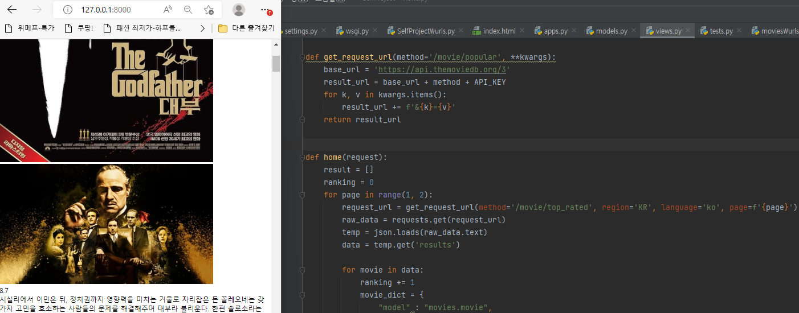

## 영화 추천 사이트를 만들어보자

공부를 하며 남는 시간에 공부한 내용을 적용시키기 위한 개인 프로젝트를 시작하기로 햇다.

내용을 TMDB를 활용하여 영화 추천알고리즘을 만드는 것이 주 목적이다.

## TMDB

TMDB는 일종의 영화, TV관련된 위키와 같다고 하며 완전 오픈소스의 데이터를 제공하며 데이터베이스 API를 통해 정보를 가져올 수있다.

https://developers.themoviedb.org/3/getting-started/introduction

API를 활용하는 방법 외에도
https://www.kaggle.com/datasets/tmdb/tmdb-movie-metadata

해당 사이트에서 TMDB의 데이터셋을 다운받아 사용 할 수있다.

## 프로젝트 목적 

해당 프로젝트를 진행하며 내가 원하는 데이터를 색인하기 위해 어떤 쿼리를 작성해야 하는지.

카테고리 및 검색을 할때는 어떤 방식의 쿼리를 써야되는지 등 ORM 위주의 공부가 진핼될 것이며, 어느정도 구성이 끝난 이후에는 pandas, numpy, sklearn 등을 이용하여 딥러닝을 통한 추천 알고리즘 작성도 시도할 것이다.

## API 동작 확인

API키를 통해서 TMDB에서 데이터를 잘 받아오고 있다.

이후 진행에서 해당 테이블을 분석하여 내 DB가 어떤 테이블로 이루어 져야할지 고민해볼 것이다.

