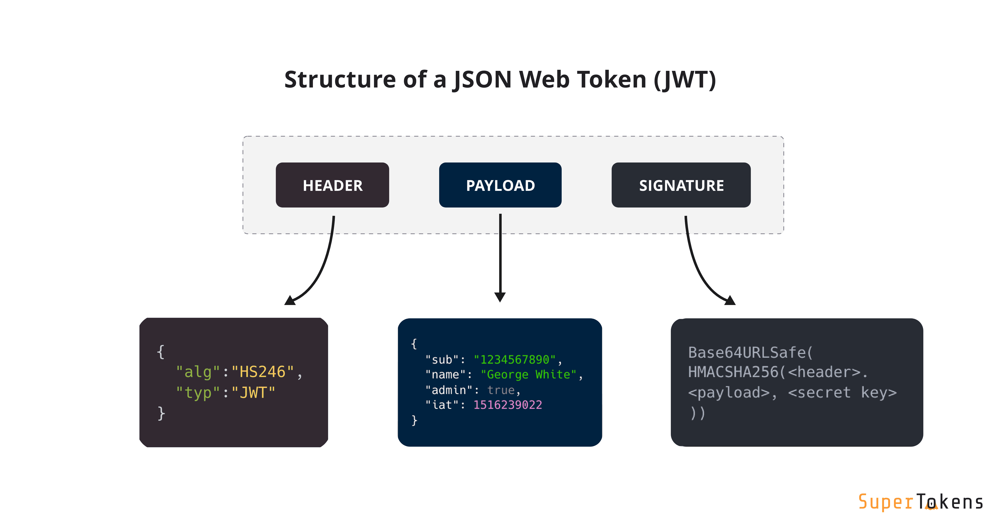

# JSON Web Token 개념 이해 - 2

## JSON Web Token 구조

JWT는 .을 구분자로 나누어지는 세 가지 문자열의 조합이다.
.을 기준으로 Header, Payload, Signature을 의미한다.



- Header
  - JWT에서 사용할 타입과 해시 알고리즘의 종류가 담긴다.

```JSON
  Header
  {
    "alg": "HS256",
    "typ": "JWT",
  }

alg : 서명 암호화 알고리즘(ex: HMAC SHA256, RSA)
typ : 토큰 유형
```

- Payload
  - 서버에서 첨부한 사용자 권한 정보와 실제로 사용될 데이터가 담긴다.
  - 정해진 데이터 타입은 없지만 대표적으로 Registered claims, Public claims, Private claim으로 나뉜다.
  - Registed claims : 미리 정의된 클레임.
    - iss(issuer; 발행자),
    - exp(expireation time; 만료 시간),
    - sub(subject; 제목),
    - iat(issued At; 발행 시간),
    - jti(JWI ID)
  - Public claims : 사용자가 정의할 수 있는 클레임 공개용 정보 전달을 위해 사용.
  - Private claims : 해당하는 당사자들 간에 정보를 공유하기 위해 만들어진 사용자 지정 클레임. 외부에 공개되도 상관없지만 해당 유저를 특정할 수 있는 정보들을 담는다

```JSON
    {
        "jti": "1000", // Registered claims
        "exp": "15214300000", // Registered claims
        "https://elan5027.github.io": true // Public claims
        "username": "elan" // Private claim
    }
```

```JSON
Payload
{
    "sub": "1234567890",
    "name": "Park Ji",
    "iat": 15162901,
}
```

- Signature
  - Header, Payload 를 Base64 URL-safe Encode를 한 이후 Header에 명시된 해시함수를 적용하고, 개인키로 서명한 전자서명이 담긴다.

```JSON
    Signature = Base64Url(Header) + . + Base64Url(Payload) + server key
```

#### JWT 인코딩 / 디코딩 연습 사이트

https://jwt.io/

## JWT 인증 방식의 동작 과정

1. 사용자가 ID, PW를 입력하여 서버에 로그인 인증을 요청한다.
2. 서버에서 클라이언트로부터 인증 요청을 받으면, Header, PayLoad, Signature를 정의한다.
   Hedaer, PayLoad, Signature를 각각 Base64로 한 번 더 암호화하여 JWT를 생성하고 이를 쿠키에 담아 클라이언트에게 발급한다.
3. 클라이언트는 서버로부터 받은 JWT를 로컬 스토리지에 저장한다. (쿠키나 다른 곳에 저장할 수도 있음)
   API를 서버에 요청할때 Authorization header에 Access Token을 담아서 보낸다.
4. 서버가 할 일은 클라이언트가 Header에 담아서 보낸 JWT가 내 서버에서 발행한 토큰인지 일치 여부를 확인하여 일치한다면 인증을 통과시켜주고 아니라면 통과시키지 않으면 된다.
   인증이 통과되었으므로 페이로드에 들어있는 유저의 정보들을 select해서 클라이언트에 돌려준다.
5. 클라이언트가 서버에 요청을 했는데, 만일 액세스 토큰의 시간이 만료되면 클라이언트는 리프래시 토큰을 이용해서
6. 서버로부터 새로운 엑세스 토큰을 발급 받는다.

## JWT 장점

- Header와 Payload를 가지고 Signature를 생성하므로 데이터 위변조를 막을 수 있다.
- 인증 정보에 대한 별도의 저장소가 필요없다.
- JWT는 토큰에 대한 기본 정보와 전달할 정보 및 토큰이 검증됬음을 증명하는 서명 등 필요한 모든 정보를 자체적으로 지니고 있다.
- 클라이언트 인증 정보를 저장하는 세션과 다르게, 서버는 무상태(StateLess)가 되어 서버 확장성이 우수해질 수 있다.
  토큰 기반으로 다른 로그인 시스템에 접근 및 권한 공유가 가능하다. (쿠키와 차이)
- OAuth의 경우 Facebook, Google 등 소셜 계정을 이용하여 다른 웹서비스에서도 로그인을 할 수 있다.
- 모바일 어플리케이션 환경에서도 잘 동작한다. (모바일은 세션 사용 불가능)

## JWT 단점

- Self-contained : 토큰 자체에 정보를 담고 있으므로 양날의 검이 될 수 있다.
- 토큰 길이 : 토큰의 Payload에 3종류의 클레임을 저장하기 때문에, 정보가 많아질수록 토큰의 길이가 늘어나 네트워크에 부하를 줄 수 있다.
- Payload 인코딩 : payload 자체는 암호화 된 것이 아니라 BASE64로 인코딩 된 것이기 때문에, 중간에 Payload를 탈취하여 디코딩하면 데이터를 볼 수 있으므로, payload에 중요 데이터를 넣지 않아야 한다.
- Store Token : stateless 특징을 가지기 때문에, 토큰은 클라이언트 측에서 관리하고 저장한다. 때문에 토큰 자체를 탈취당하면 대처하기가 어렵게 된다.
